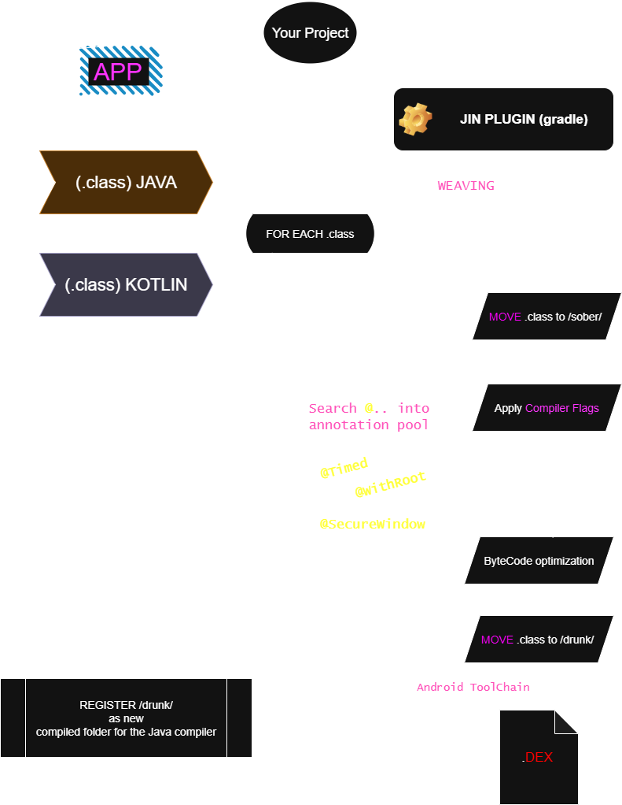

# Tired of the Same Old Helper Classes?

<div align="center">
  
</div>

<p style="font-size:18px; text-align:center;">
  <b>Jintonic</b> is the <b>first Android library fully based on AOP (Aspect-Oriented Programming)</b>.<br/><br>
  It allows you to <b>hook and weave behaviors at build time</b> directly into your <code>.class</code> files through Gradle plugins.
</p>


---

## ✨ Features

- **Easy-to-use annotations** for checks and safety:

```kotlin
@RequireInternet(mustThrow = true)
@MinBattery(minOrEqualValue = 60)
fun kotlinApiCall() = "Kotlin Api call done successfully"

@Timed
fun hello() = runBlocking {
    delay(5000)
}

@RequireVpn
fun vpnMethod() {
    LOG("Executed Vpn Method")
}

@WithRoot(forRoot = false)
fun rootMethod() {
    LOG("Inside root method")
}
```

- ✅ Hook and intercept methods with zero boilerplate
- ⚡ Build-time weaving for optimized performance
- 🔧 Full control over **cross-cutting concerns** like logging, validation, and execution policies

---

## 🚀 Getting Started

Add Jintonic to your project:

```kotlin
plugins {
    id("com.crescenzi.jintonic.gradle") version "X.Y.Z"
}

dependencies {
    implementation(":com.crescenzi.jintonic:vX.Y.Z")
}
```

---

## ⚠️ What I Have to Know

| Annotation      | Info                                                                                                            | Manifest / Permissions Required                                                                                                                                                                                                                                                                                                                                                                      |
|-----------------|-----------------------------------------------------------------------------------------------------------------|------------------------------------------------------------------------------------------------------------------------------------------------------------------------------------------------------------------------------------------------------------------------------------------------------------------------------------------------------------------------------------------------------|
| MinBattery      | Ensures that the current battery level is greater than or equal to `minOrEqualValue`. Throws exception if not. Range 0-100. | NO PERMISSIONS REQUIRED                                                                                                                                                                                                                                                                                                                                                                              |
| RequireInternet | Checks if there is an active Internet connection before executing the method. Throws exception if `mustThrow = true`. | `<uses-permission android:name="android.permission.ACCESS_NETWORK_STATE"/>` <br> `<uses-permission android:name="android.permission.INTERNET"/>`                                                                                                                                                                                                                                                     |
| RequireVpn      | Throws an exception if a VPN is active during method execution.                                               | `<uses-permission android:name="android.permission.ACCESS_NETWORK_STATE"/>`                                                                                                                                                                                                                                                                                                                          |
| Timed           | Logs the execution time of the method. Does not modify method execution.                                       | NO PERMISSIONS REQUIRED                                                                                                                                                                                                                                                                                                                                                                              |
| WithRoot        | Checks if the device is rooted. Executes method based on `forRoot` parameter.                                  | `<queries>` <br> `<package android:name="com.noshufou.android.su" />` <br> `<package android:name="com.thirdparty.superuser" />` <br> `<package android:name="eu.chainfire.supersu" />` <br> `<package android:name="com.koushikdutta.superuser" />` <br> `<package android:name="com.zachspong.temprootremovejb" />` <br> `<package android:name="com.ramdroid.appquarantine" />` <br> `</queries>` |
| SecureWindow    | Allows blocking screenshots and screen recording for the annotated Activity class.                               | NO PERMISSIONS REQUIRED                                                                                                                                                                                                                                                                                                                                                                              |


---


## 🔍 How it works?

<div align="center">
  
</div>

---

## 🤝 Contributing

Contributions are welcome!

```bash
# Clone the repo
git clone https://github.com/daniele-NA/jintonic
cd jintonic

# Build and test locally
./gradlew build
./gradlew test
```

- Open issues for bugs or feature requests
- Fork the repo, make your changes, and submit a PR
- Follow the existing coding style and keep commits clean and descriptive

---

## 📄 License

This project is **open source** under the **GNU GPL v3 license**.  
See the **LICENSE** file for details.
